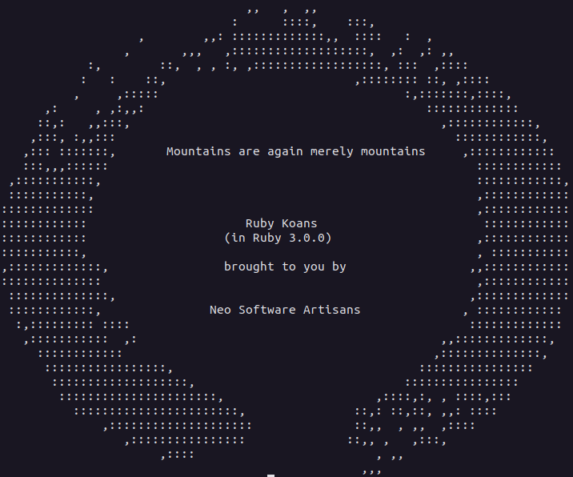

<h1 align="center">
  <strong>Learning Ruby with Ruby Koans</strong>
</h1>

<div align="center">
  <a href="#-Idea">Idea</a>&nbsp;&nbsp;&nbsp;|&nbsp;&nbsp;&nbsp;
  <a href="#-Ruby Koans">Ruby Koans</a>&nbsp;&nbsp;&nbsp;|&nbsp;&nbsp;&nbsp;
  <a href="#-Installing Ruby">Installing Ruby</a>&nbsp;&nbsp;&nbsp;
</div>

<br>
<div align="center">
    <br><br>
    
</div><br>

## 💡 Idea
<details>
<summary><b> PT-br</b></summary>
<p>
A ideia do processo é  conhecer novos conceitos sobre a linguagem de programação ruby. ⚠️ Enfatizo que quem estiver olhando este repositório tenha cuidado, ele contém as possíveis resoluções dos koans propostos. Também noto que nos arquivos existem algumas notas / comentários que fiz ao longo da minha viagem. (em pt-br)
</p>
<hr>
</details>
<p>
The idea of the process is to learn new concepts about the ruby programming language. ⚠️ I emphasize that whoever is looking at this repository be careful, it contains the possible resolutions of the proposed koans. I also notice that in the archives there are some notes/comments I made along my trip. (in pt-br)
</p>

## 📌 Ruby Koans
<details>
<summary><b> PT-br</b></summary>
<p>
Os koans são divididos em áreas por arquivo, hashes são cobertos em about_hashes.rb, módulos são introduzidos em about_modules.rb, etc. Eles são apresentados em ordem no arquivo path_to_enlightenment.rb.

Cada koan aumenta seu conhecimento de Ruby e se constrói a partir de si mesmo. Ele irá parar no primeiro lugar que você precisar corrigir.

Alguns koans simplesmente precisam ter a resposta correta substituída por uma incorreta. Adicione, no entanto, exigir que você forneça sua própria resposta. Se você vir o método __ (um sublinhado duplo) listado, é uma dica para fornecer seu próprio código para fazê-lo funcionar corretamente.
</p>
<hr>
</details>
<p>
The koans are broken out into areas by file, hashes are covered in about_hashes.rb, modules are introduced in about_modules.rb, etc. They are presented in order in the path_to_enlightenment.rb file.

Each koan builds up your knowledge of Ruby and builds upon itself. It will stop at the first place you need to correct.

Some koans simply need to have the correct answer substituted for an incorrect one. Some, however, require you to supply your own answer. If you see the method __ (a double underscore) listed, it is a hint to you to supply your own code in order to make it work correctly.

Access: <a href="https://http://rubykoans.com/">rubykoans.com</a>
</p>

## <a href="https://www.ruby-lang.org" emoji-code="Ruby"></a> Installing Ruby
<details>
<summary><b> PT-br</b></summary>
<p>
Se você não tiver o Ruby configurado, visite <a target="_blank" href="https://www.ruby-lang.org/en/downloads/">ruby-lang.org</a> para obter instruções operacionais específicas. Para executá-lo, você precisa do ruby e do rake instalados. Para verificar as instalações basta digitar:

```bash
$ ruby --version
$ rake --version
```

Windows no prompt de comando (cmd.exe)

```cmd
c:\ruby --version 
c:\rake --version
```

Qualquer resposta para Ruby com um número de versão maior que 1.8 está bem (deve ser em torno de 1.8.6 ou mais). Qualquer versão do rake serve.
<hr>
</details>
If you do not have Ruby setup, please visit <a target="_blank" href="https://www.ruby-lang.org/en/downloads/">ruby-lang.org</a> for operating specific instructions. In order to run this you need ruby and rake installed. To check the installations simply type:

```bash
$ ruby --version
$ rake --version
```

Windows from the command prompt (cmd.exe)

```cmd
c:\ruby --version 
c:\rake --version
```
Any response for Ruby with a version number greater than 1.8 is fine (should be around 1.8.6 or more). Any version of rake will do.

---

<div align="center">
Solved with love and dedication by <a target="_blank" href="https://ernanej.github.io/my-linktree/">Ernane Ferreira</a>. 👋🏻<br/>
<small>Project carried out in support of the company  <a target="_blank" href="https://www.seguroviagem.srv.br/">Real Seguro Viagem</a> in its internship process. <small>
</div>
